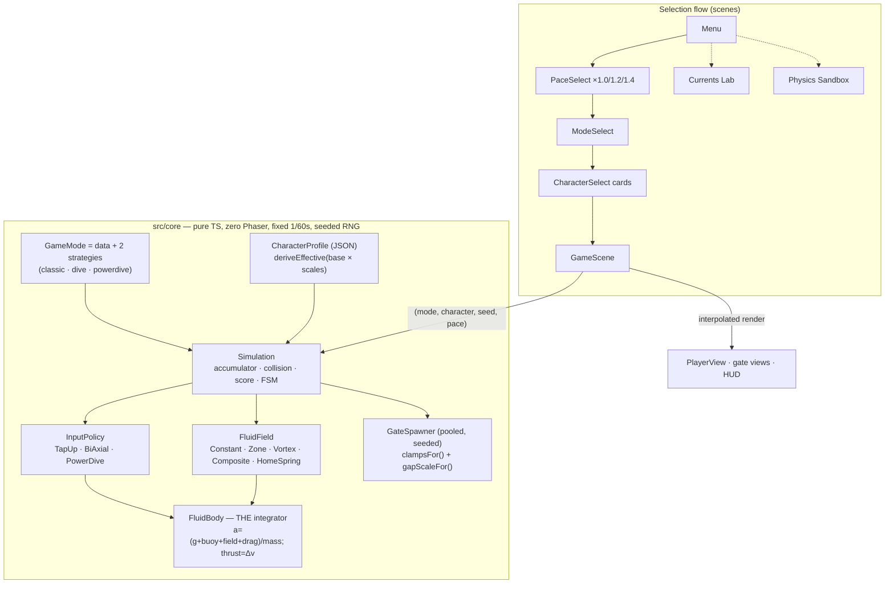
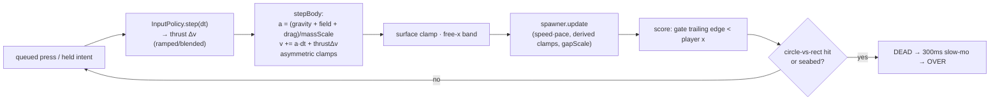

# Underwater Flappy / "Floatsam" — Build Handoff v2
**Version:** v0.6.0 (Phases 1–6 closed, Phase 7 built, Power Dive shipped) · **Date:** 2026-06-14 · **Executor:** Claude Code (Fable 5, prior increments Opus 4.8)
**Plans executed:** ARCHITECTURE.md v2.0 (Phases 1–3) → ARCHITECTURE v3_3.md "Floatsam" (Phases 5–8 program; P6 closed, P7 built) → owner-directed extensions (this doc §4).

Self-contained: paste into the planning chat without repo access. Full audit trail: `docs/DECISIONS.md` (ADR-001…013 + gates G1–G3, G6). Companion docs: `PHYSICS_SPEC.md`, `TEST_PLAN.md`, `README.md`.

---

## 1. Executive status

| Milestone | Gate | Status |
|---|---|---|
| P1 Foundation & physics sandbox | G1 | ✅ Closed (2026-06-12) |
| P2 Classic mode complete | G2 | ✅ Closed (2026-06-12) |
| P3 Polish, audio, web release | G3 | ✅ Closed, 5 environmental items deferred (Lighthouse, x-browser, prod domain, analytics, device soak) |
| P5 Ship the web build | G5 | ⏳ **Owner-gated, in flight** — GitHub account connection paused mid-setup (§6) |
| P6 Modes + Characters + Dive | G6 | ✅ **Closed (2026-06-14)** — 80,000-run fairness matrix, 0 failures |
| P7 Currents Lab (internal) | G7 | 🟡 **Built & invariant-tested**; human "currents feel right" sign-off still open |
| P8 Mobile packaging & stores | G8 | ⏳ Not started — owner-gated (accounts, Mac lane, devices) |
| — Power Dive (owner-requested, beyond v3.3) | — | ✅ Shipped as 3rd public mode (ADR-013, "advanced" fairness bar) |

**Quality posture right now:** 94 unit/sim tests + 11 Playwright e2e, all green. Golden-master regression proves Classic(Seal) is **bit-identical** to the v0.3.0 ship through every refactor. Fairness: **8 pairs × 10,000 seeds = 80,000 runs, 0 failures** (Classic/Dive × 4 characters); Power Dive held to a documented ≥99% "advanced" bar (measured 99.5–100%). Build 1.20 MB (budget 3 MB). No GitHub remote yet — everything is local commits + tags (`v0.3.0`, `v0.6.0`).

## 2. What shipped since Handoff v1 (v0.3.0 → v0.6.0)

**The two bit-identical refactor gates** (P6 steps 1–2, the program's risk item): `GameMode` extraction and `CharacterProfile` insertion, each proven by a frozen 1,500-frame golden-master fixture that reproduces the shipped Classic(Seal) trajectory exactly (all Seal scales ≡ 1.0; `X·1.0 === X` in IEEE754 makes the proof arithmetic, not statistical).

**Three public modes:**
- **Classic** — tap-to-swim (locked, golden-verified).
- **Dive** — bidirectional thrust, near-neutral buoyancy. Input locked by owner playtest (ADR-009): keyboard ↑↓/WS, mouse left=rise / **right=dive**, touch screen-halves.
- **Power Dive** (ADR-013) — a dive lunges **down and forward**; free-x body in a band with a mass-scaled home-spring pulling back to column. Deliberately advanced; the free-x body is the seam for lateral currents.

**Four characters** (pure JSON + procedural sprite each), presented as **trading cards** (traits 1–5, OVR, rarity, role, flavor) in a carousel:

| # | Card | Physics identity | Scales (mass/thrust/drag/buoy) | Hitbox |
|---|---|---|---|---|
| 01 | Seal · common · OVR 59 | Baseline (locked) | 1.0 / 1.0 / 1.0 / 1.0 | 19.2 |
| 02 | Otter · rare · OVR 71 | Light, agile, weak flap | 0.70 / 0.70 / 0.84 / 0.90 | 14 |
| 03 | Puffer · uncommon · OVR 48 | Heavy, floaty, wide | 1.40 / 1.18 / 1.30 / 1.16 | 26 |
| 04 | Sea Lion · epic · OVR 44 | Heavy, powerful bruiser | 1.35 / 1.40 / 1.15 / 1.00 | 24 |

**Pace wrapper** — Base ×1.0 / Faster ×1.2 / Turbo ×1.4 scroll-speed multiplier; spawner re-derives inter-gate time so reachability clamps tighten with tempo automatically. Flow: Menu → Tempo → Mode → Creature → Game.

**Currents Lab** (P7, surfaced in-menu per owner) — real vector fields (`ZoneField` smoothstep-edged, `VortexField` solid-body core + 1/r decay + cap, `CompositeField` superposition, `HomeSpringField`), a `FieldVisualizer` (flow-arrow grid + advected tracer particles), 5 authored presets incl. a downcurrent stress preset, free-swim with in-Lab character switching. Otter-anchored §3.5 safety invariants unit-tested over a dense grid.

**Fairness became derived, not tuned** (the big engineering theme): `clampsFor(character, mode)` derives vertical reachability clamps and `gapScaleFor(character, mode)` derives gap size from the pair's own physics (hitbox ratio × Classic overshoot factor; enlarge-only; Seal ≡ 1.0). First probe had Classic Puffer/Sea Lion at **0%** pass; after derivation, all pairs 100%.

**UI:** reusable Button component (primary/ghost, hover/press), proper back buttons everywhere, PLAY / CURRENTS LAB menu, GameOver action buttons, deep links (`?play=1&mode=&character=&seed=&pace=`).

## 3. Architecture as built



**Per-fixed-step logic (the sim loop):**



**Binding invariants (all enforced by tests):** FluidBody is the only integrator; determinism keyed per (seed, mode, character, pace); all tunables in `src/config/*.json`; Classic(Seal) tuning-locked — any change to values it consumes requires an ADR + fresh 10k sweep + golden-master pass.

## 4. Deviations & decisions ledger (ADR summary)

| ADR | Decision | Why it matters to planning |
|---|---|---|
| 005 | v3.3 accepted; 001–004 ratified | — |
| 006 | `massScale` divides continuous forces only; thrust stays a Δv scaled by `thrustScale` | Keeps "flap power" and "inertia" independent tuning axes |
| 007 | Name "Floatsam" recorded, **OPEN** | Still blocks G8 store assets only |
| 008 | Seal hitbox truth is 19.2 (spec omitted the ×0.8); Otter re-derived to preserve "~21% smaller" intent | Spec correction to fold into v3.4 |
| 009 | Dive input locked (multi-scheme: keys/mouse-buttons/touch-halves) | Owner-playtested; thumb-drag dropped |
| 010 | Roster expanded to 3 early (Puffer) + trait-card metadata + OVR; Otter amplified | §9 roster growth pulled forward on owner request |
| 011 | Currents Lab surfaced in-menu (not `?lab=1`-only); pace wrapper; Sea Lion (4th); drift-velocity invariant deferred to public Currents mode | Lab store-gating deferred to P8 |
| 012 | `gapScaleFor` — spawn geometry derived per pair, enlarge-only, Seal ≡ 1.0 | **Fairness is now correct by construction for any future creature** |
| 013 | Power Dive: free-x + forward lunge; mass-scaled spring; **relaxed ≥99% "advanced" fairness bar** | First mode class where horizontal position matters → currents seam |

## 5. The compressed plan — 2.5-day Fable sprint (supersedes v3.3's week-scale P5–P8 pacing)

Principle: pull everything ownable-by-the-agent forward, park what needs accounts/hardware behind owner actions that can happen in parallel. Fairness/golden gates stay mandatory at every step.

```mermaid
flowchart LR
    subgraph S1["Sprint 1 · ~0.5 day — SHIP"]
        A1["GitHub connect + push (owner unblocks)"]
        A2["Cloud CI green · Pages URL live"]
        A3["PWA + Lighthouse on prod build"]
        A4["Feel-sim suite (tap-rate, depth-hold §4.1 targets)"]
    end
    subgraph S2["Sprint 2 · ~1 day — CURRENTS INTO GAMEPLAY"]
        B1["Lateral/vertical current zones spawn in Power Dive levels"]
        B2["Current telegraphing (visual language from Lab viz)"]
        B3["Fairness sweeps with currents (otter-anchored budgets)"]
        B4["G7 close: owner feel sign-off in Lab"]
    end
    subgraph S3["Sprint 3 · ~0.5 day — PUBLIC CURRENTS MODE"]
        C1["4th mode: authored current levels (Lab presets → gameplay)"]
        C2["Matrix extension: currents × 4 characters sweeps"]
    end
    subgraph S4["Sprint 4 · ~0.5 day — RC + STORE PREP (Windows-side)"]
        D1["Per-(mode,char,pace) stats panel (leaderboard-ready keys)"]
        D2["Store-prep: icons, screenshots, privacy draft, name decision support"]
        D3["Full regression · v0.9.0-rc tag · Handoff v3"]
    end
    S1 --> S2 --> S3 --> S4
```



**Explicitly out of the sprint** (physically impossible here): iOS lane (needs Mac/cloud-Mac), store submissions (accounts), reference-device benchmarks (hardware). These stay P8 per v3.3 §6, unblocked whenever the owner provides §7 items 2–3.

## 6. Owner decision register — current state

| # | Decision | Status |
|---|---|---|
| 1 | **GitHub (games account, NOT thesis account)** | **In flight — paused mid-setup.** Machine verified clean: no `gh` CLI, no stored GitHub credentials, so no thesis-account bleed risk. Winget available to install `gh`. Owner still owes: account username, repo name, public/private, and a deliberate login with the games account. Unblocks Sprint 1 / G5. |
| 2 | Store accounts + cloud Mac lane | Open (blocks P8 only) |
| 3 | Reference devices | Open (blocks G8 only) |
| 4 | Analytics | Default stands: dropped from v1.0 |
| 5 | Audio & art licensing | Synth/procedural for web; decide before stores |
| 6 | Name — "Floatsam" | OPEN (ADR-007); needed before store assets |
| 7 | Character unlock model | Both-free default stands; roster is now 4 |

## 7. Repo map (current)

```
flappySeal/                                  14 commits · tags v0.3.0, v0.6.0 · branch main · no remote
├── ARCHITECTURE.md  ARCHITECTURE v3_3.md  README.md
├── docs/ DECISIONS.md (ADR 001–013 + gates)  PHYSICS_SPEC.md  TEST_PLAN.md  HANDOFF.md (this)
├── src/config/  physics.json difficulty.json
│   ├── modes/ classic(implicit) dive.json powerdive.json currents-lab.json
│   └── characters/ seal.json otter.json puffer.json sealion.json
├── src/core/  fluid/{FluidBody,FluidField,fields/{Zone,Vortex,Composite,HomeSpring,math,presets}}
│   ├── modes/{GameMode,classicMode,diveMode,powerDiveMode,modes}
│   ├── input/{InputPolicy,TapUpPolicy,BiAxialPolicy,PowerDivePolicy}
│   ├── character/CharacterProfile  spawn/{Spawner,clampsFor}  score/ state/ sim/ rng
├── src/scenes/ Boot Menu PaceSelect ModeSelect CharacterSelect Game Hud GameOver Pause Sandbox Lab
├── src/{entities,platform,ui,debug}/  PlayerView · KVStore · SfxSynth · Haptics · Button · FieldVisualizer
├── public/ (PWA)   scripts/check-budget.mjs   .github/workflows/ci.yml (activates on push)
└── tests/ unit(11 files) sim(6 + golden fixture + fairness harness) e2e(2 specs, 11 tests)
```

## 8. Known debts (honest list)

1. **Feel ≠ fairness:** the matrix proves every pair *clearable*; the §4.1 numeric feel targets (Otter tap-rate 1.15–1.35× Seal, Dive depth-hold ±40 px, reversal momentum-fight) are not yet committed as sims — Sprint 1 item.
2. **Power Dive** is first-pass tuned and on a relaxed fairness bar by design (ADR-013) — needs owner playtest verdict.
3. **G7 human sign-off** on Lab presets pending.
4. **Lab ships in web builds** — store-gating deferred to P8 (ADR-011).
5. G3 environmental deferrals unchanged until the push (Lighthouse, cross-browser, prod domain).
6. Legacy `uf.bestScore` key migration is not done (old best isn't surfaced in the new keyed system — trivial, folded into Sprint 4 stats work).
