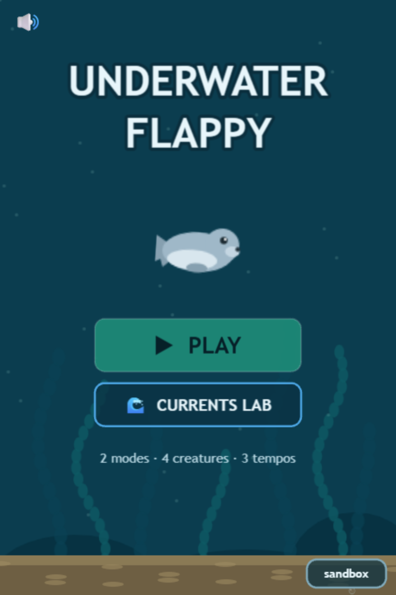

# Underwater Flappy · "Floatsam"

**Flappy, but underwater.** Buoyancy, drag and momentum replace the dry gravity-snap: every tap is a swim stroke that blends into your motion, sinking is slow, and nothing ever moves instantly. One deterministic fluid-physics core drives **three modes × four creatures × three tempos — 36 combinations**, every one machine-verified fair before a human ever plays it.

## Start here

| I want to… | Go to |
|---|---|
| Install and play | [Getting started](guide/getting-started.md) |
| Learn the three modes | [Game modes](guide/modes.md) |
| Pick a creature | [The creatures](guide/creatures.md) |
| Watch the fluid physics | [Currents Lab](guide/currents-lab.md) |
| Understand the physics math | [The fluid model](under-the-hood/physics.md) |
| Add my own creature | [Add a creature](modding/add-a-creature.md) |

## The one-paragraph pitch

Classic Flappy Bird works because one input maps to one instant response. This game asks: what if the medium fought back? Underwater, your impulse blends over frames, drag steals your speed quadratically, and shedding altitude is *slow* — descents, not climbs, are the scarce resource. Three modes explore that idea: **Classic** (one tap, pure buoyancy), **Dive** (actively swim both directions), and **Power Dive** (a dive lunges you down *and forward*). Four creatures with genuinely different mass, thrust, drag and buoyancy make the same water feel different every run.

> **Version:** v0.6.0 · engine Phaser 3.90 + a bespoke pure-TypeScript fluid core · 94 unit/sim tests + 11 e2e · fairness proven over 80,000 simulated runs.
