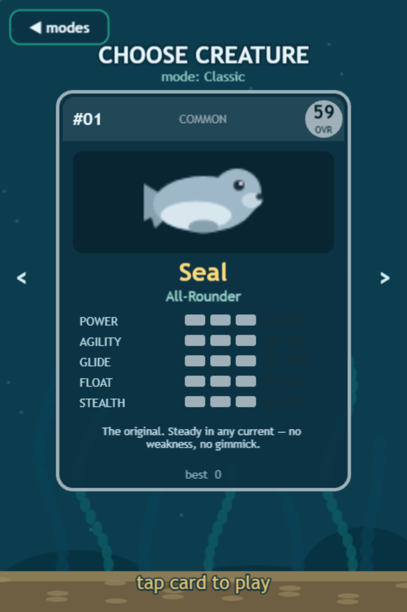
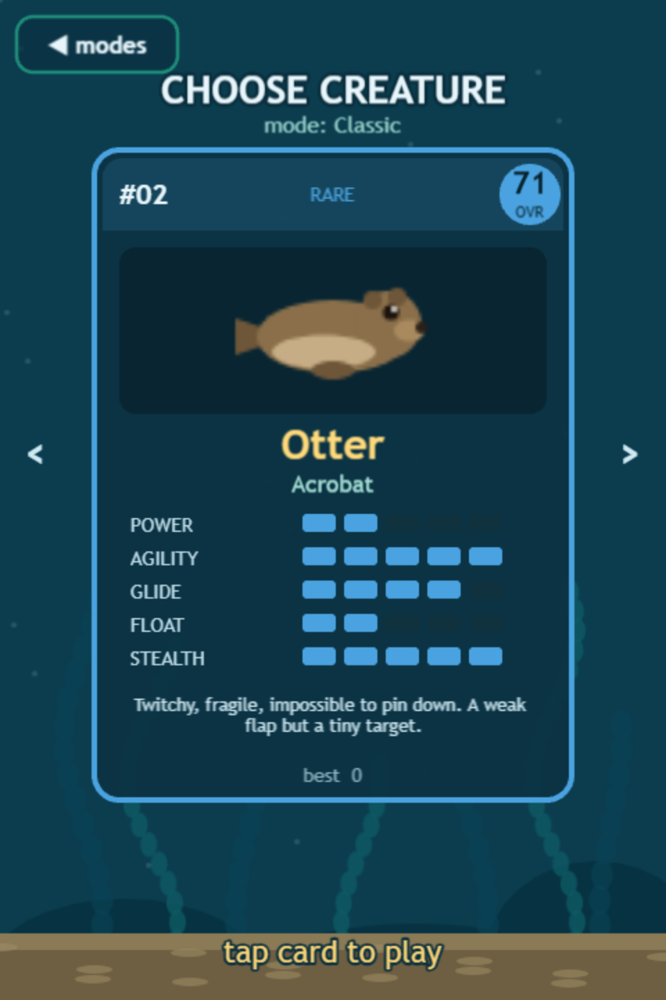

# The creatures

A creature isn't a skin — it's a **physics profile**. Mass, flap power, drag, buoyancy and hitbox all differ, so the same water genuinely feels different. Pick from the card carousel; every card shows the trait spread and an overall rating.

 

## The roster

| # | Creature | Role · rarity | OVR | Feels like |
|---|---|---|---|---|
| 01 | **Seal** | All-Rounder · common | 59 | The baseline. Balanced stroke, honest sink, medium body. When in doubt, Seal. |
| 02 | **Otter** | Acrobat · rare | 71 | Twitchy and light — a weak flap you'll spam, but a tiny hitbox that threads gaps the others can't. High skill ceiling. |
| 03 | **Puffer** | Drifter · uncommon | 48 | Barely sinks, pushes hard, turns like a shopping cart. Huge body — but the reef gives it wider gaps to match. |
| 04 | **Sea Lion** | Bruiser · epic | 44 | Heavyweight with a thunderous stroke. Slow to change its mind, unstoppable once moving. Monstrous Power Dive lunge. |

## What the traits mean

* **Power** — flap/thrust strength (`thrustScale`). More power = bigger arcs, harder lunges.
* **Agility** — how quickly your inputs change your motion (low mass = snappy).
* **Glide** — how well speed carries (low drag).
* **Float** — buoyancy bias; high float barely sinks at rest.
* **Stealth** — hitbox size, inverted. High stealth = small target.

## Fair by design

The level generator reads *your creature's* physics before laying out the reef: gap sizes and gate-to-gate jumps are **derived from your actual arc height, terminal velocities and hitbox** — never shared blindly across the roster. A Puffer's course is physically different from an Otter's, and both are verified passable across 10,000 simulated runs each. Details in [Fairness by construction](../under-the-hood/fairness.md).

Best scores are tracked **per (mode, creature)** — your Dive·Otter record never overwrites your Classic·Seal one.
