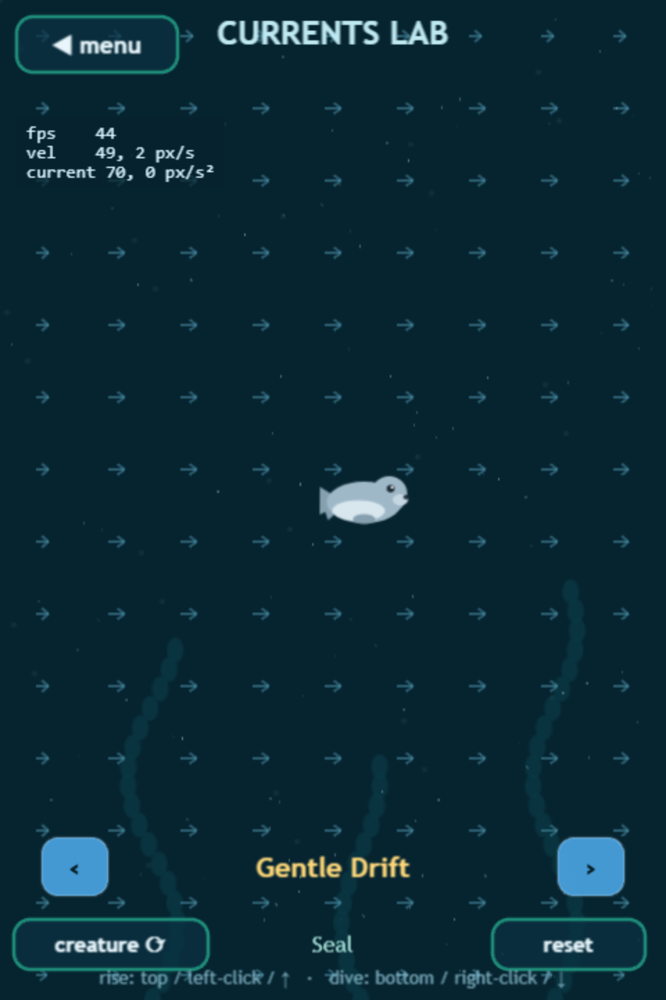
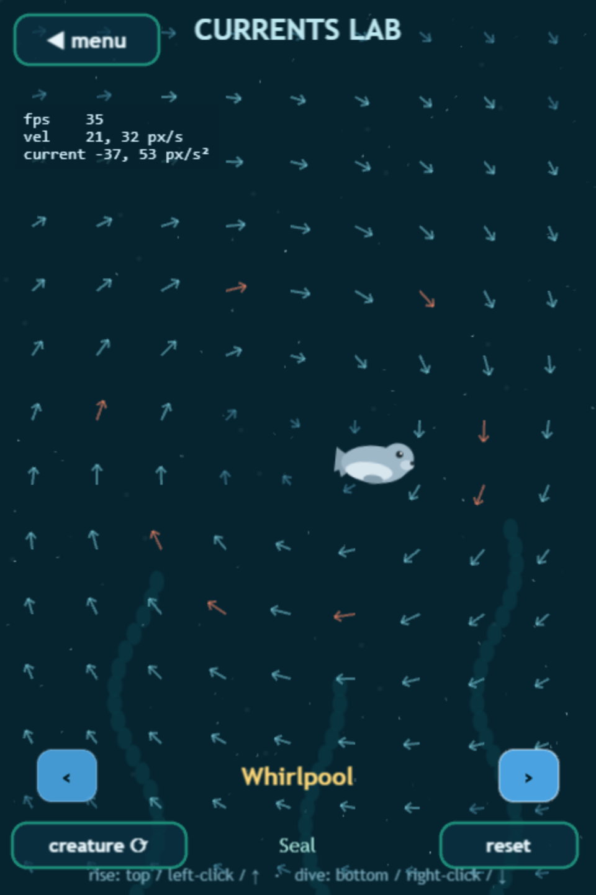

# Currents Lab

The Lab is the game's **fluid-dynamics testing ground** — open it from the main menu. There are no gates and no death: just you, a creature, and an authored current field you can *see*.

## Reading the visualization

* **Arrows** — the force field sampled on a grid. Direction = flow direction; length and color = strength (blue → teal → orange as it intensifies).
* **Streaks** — tracer particles advected by the field, showing how the water actually carries things.
* **Telemetry** (top-left) — your velocity and the current's force at your exact position, live.

Swim with the standard Dive controls and feel the field fight or carry you.

## The presets

| Preset | What it teaches |
|---|---|
| **Gentle Drift** | A uniform sideways push — the simplest possible current |
| **Whirlpool** | A vortex: solid-body rotation in the core, decaying swirl outside, slight inward pull |
| **Up & Down Drafts** | Two opposing vertical columns — cross the seam and feel the shear |
| **Riptide** | A strong down-and-sideways current that stresses your descent budget |
| **Twin Eddies** | Two counter-rotating vortices and the corridor between them |

Use **creature ⟳** to swap bodies mid-preset — a Puffer rides a vortex very differently from an Otter — and **reset** to re-center.

## Why it exists

Currents are built from three composable field types (zones, vortices, superposition) that are *pure functions of position* — deterministic, testable, and bounded so that even the weakest creature always has the thrust to escape. The Lab is where those fields get tuned by feel before they graduate into real gameplay. The physics behind it: [The fluid model](../under-the-hood/physics.md).
