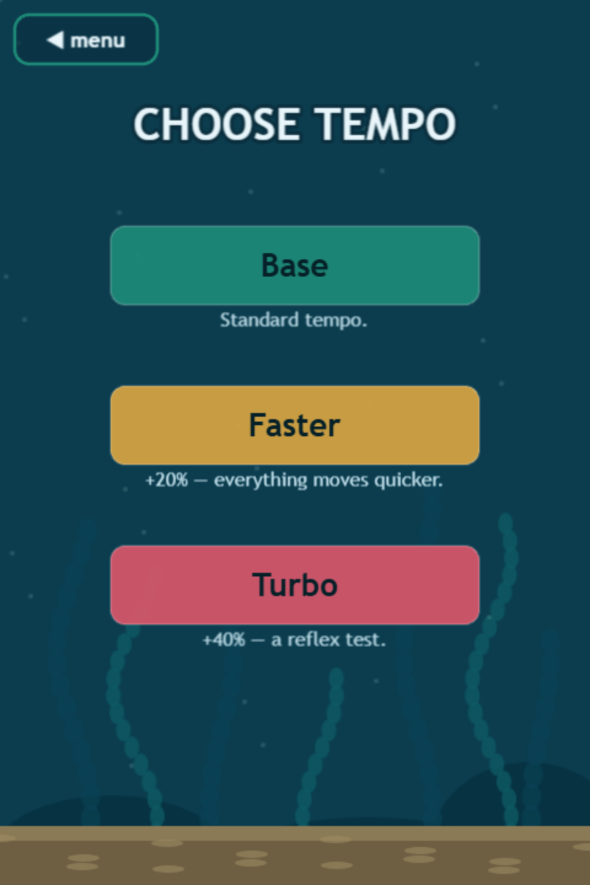

# Getting started

## Requirements

* Node.js 18+ (developed on 24) and npm
* Any modern browser — the game is WebGL/Canvas via Phaser 3 and runs at 60 fps on desktop and mid-range mobile

## Install & run

```bash
npm install
npm run dev          # → http://localhost:5173
```

The production build (`npm run build`) outputs a 1.2 MB static bundle in `dist/` — it's an installable, offline-capable PWA.

## Your first run

1. **PLAY** → pick a **tempo** (start with *Base*).
2. Pick a **mode** (start with *Classic*).
3. Pick a **creature** — tap the card to dive in (start with the *Seal*).
4. First tap starts the world. Swim through the reef gaps; one touch is death; each gate is a point.



## Controls

| Action | Touch | Mouse | Keyboard |
|---|---|---|---|
| Classic: swim stroke | tap anywhere | left-click | `↑` / `W` / `Space` |
| Dive modes: rise | hold **top half** | hold **left button** | hold `↑` / `W` |
| Dive modes: dive | hold **bottom half** | hold **right button** | hold `↓` / `S` |
| Mute | 🔊 icon (top-left) | same | — |
| Pause | automatic when the tab loses focus; tap to resume | | |

## Deep links

Every screen and configuration is addressable by URL — handy for sharing a challenge or jumping straight into a setup:

```
/?play=1&mode=dive&character=otter        straight into a run
/?play=1&mode=classic&seed=42             deterministic obstacle course
/?pace=1.4                                Turbo tempo override
/?scene=lab | sandbox | pace | mode | character
```

Same `seed` = the exact same obstacle course, every time, on every machine. Race a friend on the same seed.
