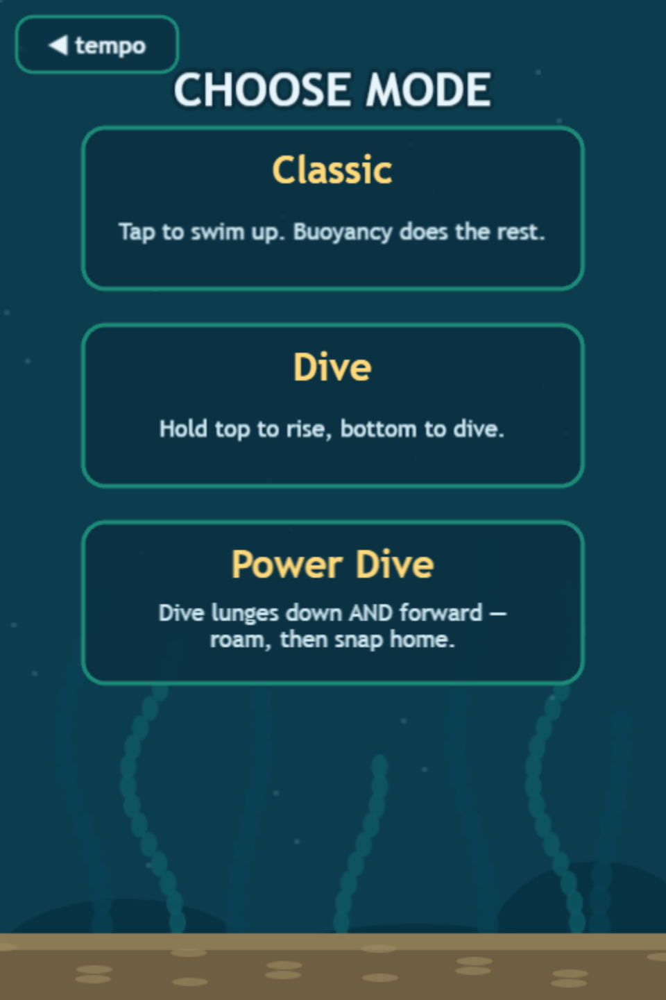
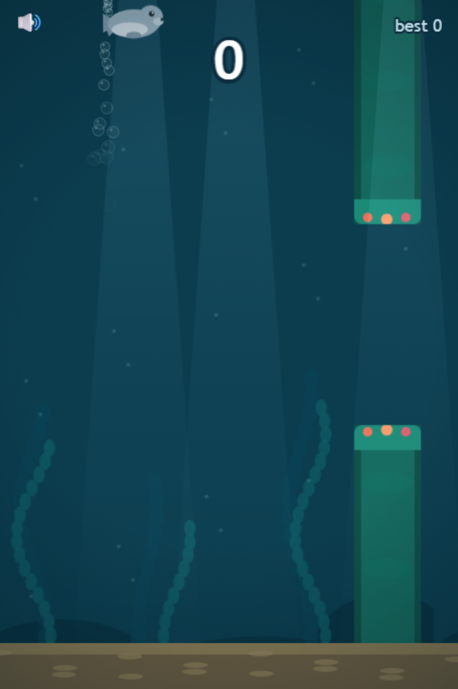
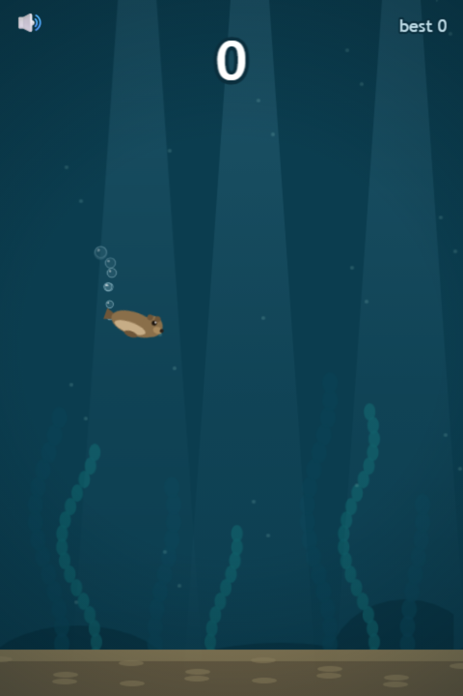
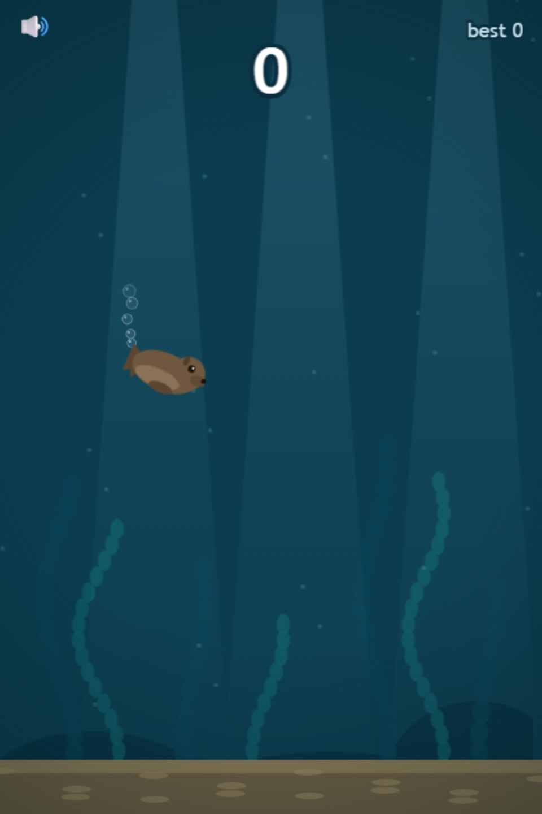
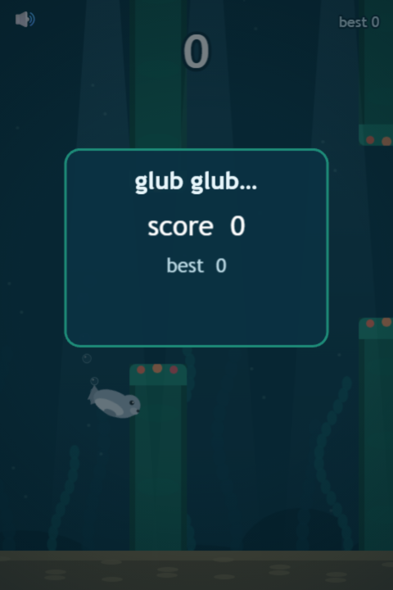

# Game modes

## Classic — tap to swim

The original. Constant net-sink buoyancy pulls you down at up to ~120 px/s; each tap is a swim stroke worth 330 px/s of upward Δv, **blended over 3 frames** so momentum carries — it never snaps your velocity like dry-land Flappy.

**How to get good:**

* **Ride the lower third of each gap.** Your tap arc peaks ~50 px above where you tap; hugging the gap's centerline gets you clipped by the top lip.
* **Descents are the trap.** Sinking is slow (drag fights you) and every correction tap costs you ~50 px of altitude budget. When the next gap is lower, stop tapping *early* and sail the bottom of the current gap.
* Chained taps stack smoothly — three quick strokes read as one sustained climb.

## Dive — swim both ways

Near-neutral buoyancy: you barely drift. Hold to **rise**; hold the other way to **dive**. Thrust ramps in over ~120 ms and decays over ~180 ms — reversals have a visible momentum-fight, like turning a real body in water.

Gaps move both up *and* down aggressively here, because you finally have the descent authority Classic denies you.

## Power Dive — the advanced mode

A dive doesn't just take you down — it **lunges you forward**, and you're free to drift horizontally inside a band. A spring pulls you back to your home column when you let go. The lunge strength scales with your creature's flap power: a Sea Lion surges like a torpedo, an Otter barely scoots.

**Why it's marked advanced:** diving to lose altitude *also* throws you at the next pipe sooner. You have to plan descents around your horizontal position — dive early and drift home, or hold formation and take the vertical lane. This coupling is deliberate: it's the doorway through which flowing currents will enter the game.

## Death & retry

One touch of reef or seabed and it's over — a 300 ms slow-motion drift, then the score panel. Retry is instant; *change mode / creature* jumps you back into the selection flow.

