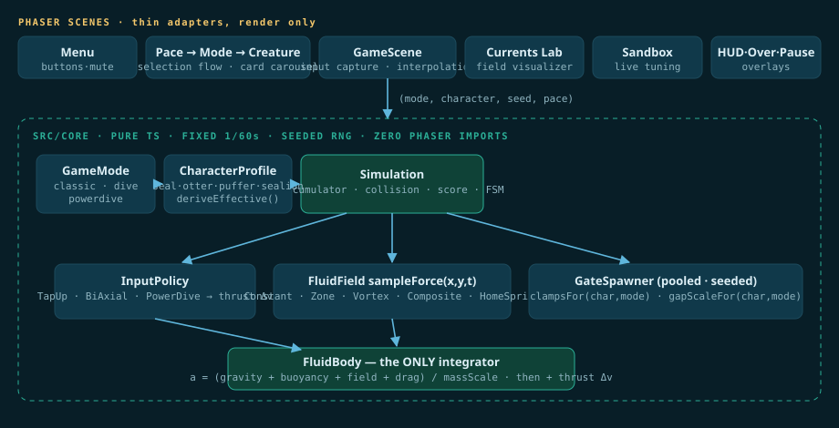

# Architecture

The core rule: **`src/core/` has zero engine imports.** It's pure TypeScript — deterministic, unit-testable, portable — and Phaser scenes are thin adapters that render interpolated snapshots of it.



## The composition model

A run is fully described by four values: **(mode, creature, seed, pace)**.

* A **GameMode** is data plus two strategy objects: an `InputPolicy` (how input becomes thrust) and a `FluidField` factory (what the water does). Classic, Dive and Power Dive differ *only* in these.
* A **CharacterProfile** is one JSON file of scale factors (mass, thrust, drag, buoyancy) plus a hitbox radius and card metadata. `deriveEffective(mode.physics × profile)` produces the effective constants once, at run start.
* **FluidBody is the only integrator.** Every force source returns an acceleration; nothing else in the codebase mutates velocity. This single-chokepoint rule is what made two architecture-level refactors provably behavior-preserving.

## Determinism as a feature

Fixed 1/60 s steps behind an accumulator, a seeded RNG for obstacle generation, and inputs consumed only at step boundaries: identical inputs ⇒ bit-identical runs. Rendering interpolates between steps, so display frame rate never affects the simulation.

This buys three things:

1. **Golden-master regression** — a frozen 1,500-frame recording of the original game that must reproduce *exactly* after every change. It has survived the mode-system refactor, the character system, and four content expansions.
2. **Mass simulation** — fairness sweeps run 10,000 seeded games per configuration in seconds, headless.
3. **Shareable seeds** — `?seed=42` is the same course for everyone.

## Project layout

```
src/
├── config/            all tunables (physics, difficulty, modes/, characters/)
├── core/              pure TS: fluid/ (integrator + fields), input/, modes/,
│                      character/, spawn/, score/, state/, sim/, rng
├── scenes/            Boot · Menu · PaceSelect · ModeSelect · CharacterSelect
│                      · Game · Hud · GameOver · Pause · Sandbox · Lab
├── entities/ ui/ debug/ platform/
tests/
├── unit/  sim/        94 tests incl. golden master + fairness matrix
└── e2e/               11 Playwright tests (real browser)
```
