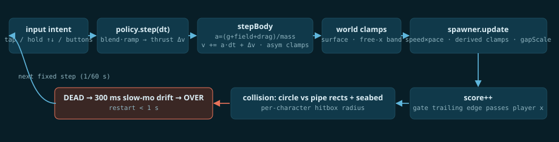

# The fluid model

Everything "underwater" about the feel comes from four forces, integrated at a fixed 1/60 s timestep. Mass is normalized, so all tuning values are accelerations in px/s² — human-readable JSON.

## The forces

```
a_gravity   = +gravity                        // 600, screen-down positive
a_buoyancy  = field.sampleForce(x, y, t).y    // Classic: constant −400 (net sink 200)
a_drag      = −c · v · |v|                    // quadratic — THE underwater feel
thrust Δv   = input policy output             // blended tap or ramped hold
```

Per fixed step, the integrator computes `a = (gravity + buoyancy + field + drag) / massScale`, then `v += a·dt + thrustΔv`, with asymmetric terminal clamps (rise vs sink).



## Why it feels like water

* **Quadratic drag** means terminal velocity: an idle Seal sinks at exactly `√(net/c) ≈ 119.5 px/s`, and fast motion bleeds off dramatically. Nothing coasts forever, nothing stops instantly.
* **Momentum is sacred.** A Classic tap is a Δv of 330 spread over 3 frames; Dive thrust ramps in over 120 ms. Velocity is *never set* — every input fights the motion you already have. Reversals visibly struggle.
* **Descents are scarce.** Net sink is only 200 px/s² against heavy drag, so losing altitude is slow — the defining strategic constraint of the whole game. (Dive mode exists to hand you the descent authority the medium denies you.)

## The design law we learned the hard way

The first tuning gave taps a ~95 px arc against a 105 px gap half-height — and a 10,000-run simulation showed it was unwinnable in >99% of seeds: every mid-gap correction tap injected a full gap of altitude, and drag made recovering impossible. The fix: smaller chainable strokes (~50 px arc) and level-generation limits derived from real descent capability. The lesson is now enforced by tests: **underwater, descents — not climbs — are the binding fairness constraint.**

## Current fields

Currents are `FluidField`s — pure functions `(x, y, t) → acceleration`:

* **ZoneField** — directional flow in a rect/circle volume, smoothstep edge falloff over ≥24 px (no force cliffs).
* **VortexField** — solid-body rotation inside the core radius, 1/r decay outside, optional inward pull, hard magnitude cap.
* **CompositeField** — vector-sum superposition of any children.
* **HomeSpringField** — `Fx = −k(x − home)`, the restoring spring under Power Dive's horizontal freedom.

Purity in `(x, y, t)` keeps every run replay-deterministic — the property the whole verification strategy stands on.

Numbers, derivations and tuning ranges: `docs/PHYSICS_SPEC.md` in the repo.
